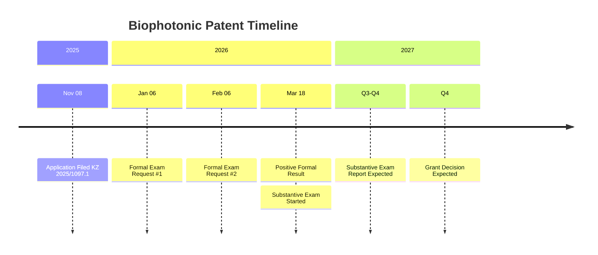
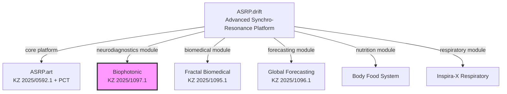

# Biophotonic / Биофотонная

> **English:** Biophotonic Optical Neurodiagnostic System  
> **Русский:** Биофотонная Оптическая Нейродиагностическая Система

---

## Repository Overview / Обзор репозитория

| Metric / Метрика | Value / Значение |
|------------------|-----------------|
| **Application № / № Заявки** | KZ 2025/1097.1 |
| **Filing Date / Дата подачи** | 08 November 2025 / 08 ноября 2025 |
| **Status / Статус** | Formal Examination Complete → Substantive Examination / Формальная экспертиза завершена → Экспертиза по существу |
| **Patent Office / Патентное ведомство** | Kazpatent (NIIS, Ministry of Justice of RK) / Казпатент (НИИС, МЮ РК) |
| **Country / Страна** | Republic of Kazakhstan / Республика Казахстан |
| **Inventors / Изобретатели** | 3 (KZ, MD, DE) |
| **IPC Classification / МПК** | A61N (Medical Devices / Медицинские устройства) |
| **Language / Язык** | Russian (Official), English (Translation) / Русский (Официальный), Английский (Перевод) |

---

## Quick Navigation / Быстрая навигация

| Section / Раздел | Description / Описание | Status / Статус |
|------------------|----------------------|-----------------|
| [**Patent Application**](#patent-application--патентная-заявка) | Application details / Детали заявки | Complete / Завершено |
| [**Timeline**](#timeline--временная-шкала) | Critical dates / Критические даты | Active / Активно |
| [**Documents**](#documents--документы) | Uploaded files / Загруженные файлы | Uploaded / Загружено |
| [**Inventors**](#inventors--изобретатели) | Team info / Информация о команде | Verified / Проверено |
| [**Correspondence**](#correspondence--переписка) | Official letters / Официальные письма | Archived / Архивировано |

---

## Patent Application / Патентная заявка

### Application Details / Детали заявки

| Field / Поле | Value / Значение |
|--------------|-----------------|
| **Application Number / Номер заявки** | 2025/1097.1 |
| **Internal Number / Внутренний номер** | Biophotonic-001 |
| **Filing Date / Дата подачи** | 08.11.2025 |
| **Priority Date / Дата приоритета** | 08.11.2025 |
| **Title (Russian) / Название (русский)** | Биофотонная оптическая нейродиагностическая система |
| **Title (English) / Название (английский)** | Biophotonic Optical Neurodiagnostic System |
| **IPC Classification / МПК** | A61N (Medical Devices / Медицинские устройства) |

### Examination Status / Статус экспертизы

| Stage / Этап | Status / Статус | Date / Дата |
|--------------|-----------------|-------------|
| **Filing / Подача** | Complete / Завершено | 08.11.2025 |
| **Formal Examination / Формальная экспертиза** | Complete / Завершено | 18.03.2026 |
| **Substantive Examination / Экспертиза по существу** | In Progress / В процессе | Expected Q3-Q4 2027 / Ожидается 3-4 кв. 2027 |
| **Grant Decision / Решение о выдаче** | Pending / Ожидается | Expected Q4 2027 / Ожидается 4 кв. 2027 |

---

## Timeline / Временная шкала

### Examination History / История экспертизы



### Critical Deadlines / Критические дедлайны

| Date / Дата | Event / Событие | Priority / Приоритет | Status / Статус |
|-------------|-----------------|---------------------|-----------------|
| **~Q3-Q4 2027** | Substantive Examination Report / Отчет экспертизы по существу | High / Высокий | Expected / Ожидается |
| **~Q4 2027** | Grant Decision / Решение о выдаче | High / Высокий | Pending / Ожидается |
| **~Q1 2028** | Patent Publication / Публикация патента | Medium / Средний | Pending / Ожидается |

---

## Documents / Документы

### Upload Status / Статус загрузки

| Category / Категория | Total / Всего | Uploaded / Загружено | Progress / Прогресс |
|---------------------|---------------|---------------------|---------------------|
| **Application Documents / Документы заявки** | 5 | 5 | 100% |
| **Correspondence / Переписка** | 5 | 5 | 100% |
| **Payment Records / Платежи** | 1 | 1 | 100% |
| **TOTAL / ИТОГО** | **11** | **11** | **100%** |

---

## Inventors / Изобретатели

**All inventors are equal co-authors / Все изобретатели являются равными соавторами**

| # | Name / ФИО | Country / Страна | IIN / ИИН | Email | Role / Роль |
|---|------------|-----------------|-----------|-------|------------|
| 1 | **OVSEANNICOVA VALERIA ALEXANDROVNA / ОВСЯННИКОВА ВАЛЕРИЯ АЛЕКСАНДРОВНА** | MD | 001228050911 | valeriaovseannicova@asrp.tech | Applicant, Inventor / Заявитель, Изобретатель |
| 2 | **BANCHENKO DENIS YURIEVICH / БАНЧЕНКО ДЕНИС ЮРЬЕВИЧ** | KZ | 800622301483 | denisbanchenko@asrp.tech | Applicant, Inventor / Заявитель, Изобретатель |
| 3 | **KAPUSTIN MYKHAILO MYKHALOVICH / КАПУСТИН МИХАЙЛО МИХАЙЛОВИЧ** | DE | 000623050976 | mykhailokapustin@asrp.tech | Applicant, Inventor / Заявитель, Изобретатель |

**Corporate Contact / Корпоративный контакт:** info@asrp.tech

**Correspondence Address / Адрес для переписки:**
```
ТОО "Перспективные Научно-Исследовательские Разработки"
УЛИЦА Комарова 37, 56
КЫЗЫЛОРДИНСКАЯ ОБЛАСТЬ, БАЙКОНУР
Республика Казахстан, 468320
Телефон: +77059131157
E-mail: info@asrp.tech
```

---

## Correspondence / Переписка

### Incoming / Входящие (Kazpatent / Казпатент)

| Date / Дата | Document / Документ | Barcode / Штрихкод | Direct Link / Прямая Ссылка |
|-------------|-------------------|-------------------|----------------------------|
| 06.01.2026 | Formal Exam Request #1 / Запрос №1 | 3804014 | [PDF](correspondence/incoming/2026-01-06_Incoming_KZ2025-1097.1_FormalExamQuery_Barcode3804014.pdf) |
| 06.02.2026 | Formal Exam Request #2 / Запрос №2 | 3845793 | [PDF](correspondence/incoming/) |
| 18.03.2026 | Positive Formal Result / Положительный результат | 3900450 | [EN](https://github.com/denisbanchenko/Kazpatent_Biophotonic_Neurodiagnostic_System_Patent/blob/main/translations/2026-03-18_PositiveFormalResult_EN_RU.md) |

### Outgoing / Исходящие

| Date / Дата | Document / Документ | Direct Link / Прямая Ссылка |
|-------------|-------------------|----------------------------|
| 04.04.2026 | Response to Formal Exam Query Iskh 35 / Ответ на запрос ФЭ Исх. 35 | [PDF](correspondence/outgoing/2026-04-04_Outgoing_KZ2025-1097.1_ResponseToFormalExamQuery_Iskh35.pdf) |

---

## Patent Connection / Патентная связь



---

## Data Structure / Структура данных

```
Kazpatent_Biophotonic_Neurodiagnostic_System_Patent/
├── README.md
├── DOCUMENT_UPLOAD_TRACKER.md
├── archive/
│   ├── 5373029522548567424.jpg
│   ├── 5373029522548567425.jpg
│   ├── 5373029522548567426.jpg
│   ├── 5373029522548567427.jpg
│   ├── IMG_3788.mp4
│   ├── ir1979_09_VERNAYA VERSIA.djvu
│   ├── ir1979_09_VERNAYA VERSIA.pdf
│   └── tekhnika_molodezhi_1970_no_02.djv
├── correspondence/
│   ├── CORRESPONDENCE_FLOW_EN_RU.md
│   ├── incoming/
│   │   ├── 2025-11-XX_Incoming_KZ2025-1097.1_Barcode3804014.pdf
│   │   └── 2026-01-06_Incoming_KZ2025-1097.1_FormalExamQuery_Barcode3804014.pdf
│   └── outgoing/
│       └── 2026-04-04_Outgoing_KZ2025-1097.1_ResponseToFormalExamQuery_Iskh35.pdf
├── docs/
│   ├── DOCUMENT_INDEX_EN_RU.md
│   ├── abstracts/
│   │   └── 2025-11-08_Abstract_KZ2025-1097.1_v1_Original_RU.docx
│   ├── applications/
│   │   └── 2025-11-08_Application_KZ2025-1097.1_v1_Original_RU.pdf
│   ├── claims/
│   │   └── 2025-11-08_Claims_KZ2025-1097.1_v1_Original_RU.docx
│   ├── descriptions/
│   │   └── 2025-11-08_Description_KZ2025-1097.1_v1_Original_RU.docx
│   └── drawings/
│       └── 2025-11-08_Figure1_KZ2025-1097.1_v1.pdf
├── INBOX/
├── legal/
├── payment-receipts/
│   └── 2025-11-08_Payment_KZ2025-1097.1_FilingFee.pdf
└── translations/
    ├── 2026-01-06_FormalExamQuery_EN_RU.md
    └── 2026-03-18_PositiveFormalResult_EN_RU.md
```

---

## Active Issues / Активные задачи

| # | State / Состояние | Title / Заголовок | Labels / Метки |
|---|-------------------|-------------------|----------------|
| 6 | OPEN | INBOX: Upload All Patent Documents Here / Загрузка: Все Документы Патента Здесь | `documentation` `EN_RU` `upload` `inbox` |
| 5 | OPEN | Project Connection: ASRP Hyperbolic Field Research Program / Подключение Проекта: Исследовательская Программа ASRP | `EN_RU` `project-connection` `ASRP` |
| 4 | OPEN | Timeline: Patent Deadlines & Milestones Tracker / Временная Шкала: Дедлайны и Вехи Патента | `EN_RU` `timeline` `deadlines` |
| 3 | OPEN | Upload Documents: All Patent Documents to Repository / Загрузка Документов: Все Документы в Репозиторий | `documentation` `EN_RU` `upload` |
| 2 | OPEN | Formal Examination: In Progress / Формальная Экспертиза: В Процессе | `EN_RU` `formal-examination` `in-progress` |
| 1 | OPEN | Application: KZ 2025/1097.1 - Complete Application Package / Полный Пакет Заявки | `patent-application` `EN_RU` `biophotonic` |

---

## Related Repositories / Связанные репозитории

### Patent Repositories / Патентные репозитории

| Repository / Репозиторий | Application / Заявка | Status / Статус |
|-------------------------|---------------------|-----------------|
| **[ASRP.art](https://github.com/denisbanchenko/Kazpatent_Axionetic_Sensing_Reactions_Platform_in_Art_Patent)** | KZ 2025/0592.1 + PCT 412362 | Private / Закрытый |
| **[Fractal Biomedical](https://github.com/denisbanchenko/Kazpatent_Fractal_Biomedical_System_Patent)** | KZ 2025/1095.1 | Private / Закрытый |
| **[Global Forecasting](https://github.com/denisbanchenko/Kazpatent_Global_Forecasting_System_Patent)** | KZ 2025/1096.1 | Private / Закрытый |
| **[ASRP.drift](https://github.com/denisbanchenko/Kazpatent_Advanced_Synchro_Resonance_Platform_For_Deep_Resonant_Patent)** | — | Private / Закрытый |
| **[Body Food System](https://github.com/denisbanchenko/Kazpatent_Body_Food_System_Patent)** | — | Private / Закрытый |
| **[Inspira-X Respiratory](https://github.com/denisbanchenko/Kazpatent_Inspira-X_Respiratory_Analysis_Patent)** | — | Private / Закрытый |

### Research Repositories / Научные репозитории

| Repository / Репозиторий | Domain / Область | Status / Статус |
|-------------------------|-----------------|-----------------|
| **[ASRP.art Research](https://github.com/denisbanchenko/Axionetic_Sensing_Reactions_Platform_in_Art)** | Art & Sensing / Искусство и зондирование | Private / Закрытый |
| **[Agricultural Study](https://github.com/denisbanchenko/Hyperbolic_Field_Agricultural_Study)** | Agriculture / Сельское хозяйство | Private / Закрытый |
| **[DAAT Crystal Study](https://github.com/denisbanchenko/Hyperbolic_Field_DAAT_Crystal_Study)** | Crystal Research / Исследование кристаллов | Private / Закрытый |
| **[Saccharomyces Cerevisiae Study](https://github.com/denisbanchenko/Hyperbolic_Field_SaccharomycesCerevisiae_Study)** | Microbiology / Микробиология | Private / Закрытый |
| **[UAP Reverse Engineering](https://github.com/denisbanchenko/UAP_Reverse_Engineering_Study)** | UAP Research / Исследование НЛО | Private / Закрытый |

---

## Navigation Index / Навигационный указатель

| Section / Раздел | Link / Ссылка |
|------------------|---------------|
| Repository Overview / Обзор репозитория | [Go / Перейти](#repository-overview--обзор-репозитория) |
| Quick Navigation / Быстрая навигация | [Go / Перейти](#quick-navigation--быстрая-навигация) |
| Patent Application / Патентная заявка | [Go / Перейти](#patent-application--патентная-заявка) |
| Timeline / Временная шкала | [Go / Перейти](#timeline--временная-шкала) |
| Documents / Документы | [Go / Перейти](#documents--документы) |
| Inventors / Изобретатели | [Go / Перейти](#inventors--изобретатели) |
| Correspondence / Переписка | [Go / Перейти](#correspondence--переписка) |
| Patent Connection / Патентная связь | [Go / Перейти](#patent-connection--патентная-связь) |
| Data Structure / Структура данных | [Go / Перейти](#data-structure--структура-данных) |
| Active Issues / Активные задачи | [Go / Перейти](#active-issues--активные-задачи) |
| Related Repositories / Связанные репозитории | [Go / Перейти](#related-repositories--связанные-репозитории) |

---

<div align="center">

**Last Updated / Последнее обновление:** 05 April 2026 / 05 апреля 2026  
**Repository / Репозиторий:** `Kazpatent_Biophotonic_Neurodiagnostic_System_Patent`  
**Standard / Стандарт:** Fully Bilingual EN_RU / Полностью двуязычный

</div>
