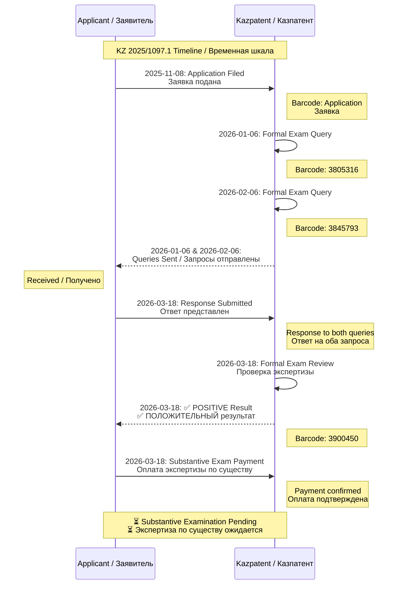
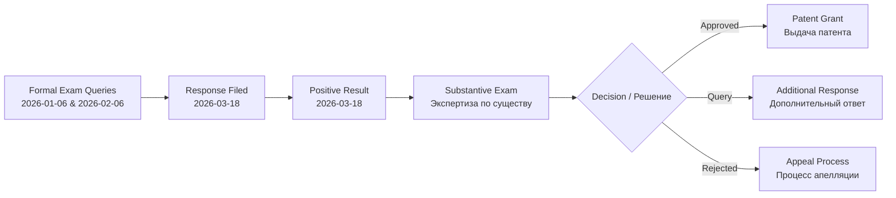
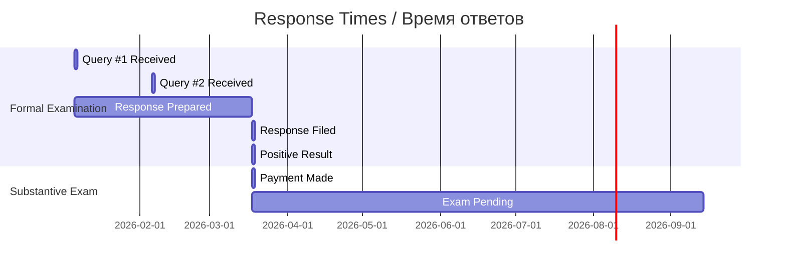

# 📨 CORRESPONDENCE FLOW / ПОТОК ПЕРЕПИСКИ

**Application Number / Номер Заявки:** KZ 2025/1097.1
**Application Title / Название Заявки:** Biophotonic Optical Neurodiagnostic System / Биофотонная Оптическая Нейродиагностическая Система
**Total Correspondence Files / Всего файлов переписки:** 6 (3 Incoming + 3 Outgoing)

---

## CORRESPONDENCE OVERVIEW / ОБЗОР ПЕРЕПИСКИ

### KZ 2025/1097.1 (Biophotonic) Correspondence Flow / Поток переписки



---

## DETAILED CORRESPONDENCE CHRONOLOGY / ДЕТАЛЬНАЯ ХРОНОЛОГИЯ ПЕРЕПИСКИ

### 📅 2025-11-08 - Application Filing / Подача Заявки

**Document / Документ:** `2025-11-08_Application_KZ2025-1097.1.pdf`

| Field / Поле | Value / Значение |
|-------------|-----------------|
| **Direction / Направление** | 📤 Outgoing / Исходящий |
| **Type / Тип** | Application Filed / Подача заявки |
| **Status / Статус** | ✅ Accepted / Принято |

**EN:** Initial patent application filed with Kazpatent including description, claims, abstract, and drawings for the Biophotonic Optical Neurodiagnostic System.

**RU:** Первоначальная патентная заявка подана в Казпатент включая описание, формулу, реферат и чертежи для Биофотонной Оптической Нейродиагностической Системы.

---

### 📅 2026-01-06 - Formal Examination Query #1 / Запрос Формальной Экспертизы №1

**Document / Документ:** `2026-01-06_Incoming_KZ2025-1097.1_FormalExamQuery_Barcode3805316.pdf`

| Field / Поле | Value / Значение |
|-------------|-----------------|
| **Direction / Направление** | 📥 Incoming / Входящий |
| **Type / Тип** | Formal Exam Query #1 / Запрос ФЭ №1 |
| **Barcode / Штрихкод** | 3805316 |

**EN:** Kazpatent formal examination identified issues requiring correction before proceeding to substantive examination.

**RU:** Формальная экспертиза Казпатент выявила замечания, требующие исправления перед переходом к экспертизе по существу.

---

### 📅 2026-02-06 - Formal Examination Query #2 / Запрос Формальной Экспертизы №2

**Document / Документ:** `2026-02-06_Incoming_KZ2025-1097.1_FormalExamQuery_Barcode3845793.pdf`

| Field / Поле | Value / Значение |
|-------------|-----------------|
| **Direction / Направление** | 📥 Incoming / Входящий |
| **Type / Тип** | Formal Exam Query #2 / Запрос ФЭ №2 |
| **Barcode / Штрихкод** | 3845793 |

**EN:** Additional formal examination query with further clarifications required.

**RU:** Дополнительный запрос формальной экспертизы с требованиями дальнейших разъяснений.

---

### 📅 2026-03-18 - Response to Formal Examination Queries / Ответ на Запросы Формальной Экспертизы

**Document / Документ:** `2026-03-18_Outgoing_KZ2025-1097.1_ResponseToFormalExamQueries.pdf`

| Field / Поле | Value / Значение |
|-------------|-----------------|
| **Direction / Направление** | 📤 Outgoing / Исходящий |
| **Type / Тип** | Response to Queries / Ответ на запросы |
| **Response Time / Время ответа** | 71 days from Query #1 (within allowed period) |

**EN:** Comprehensive response submitted addressing all issues from both Formal Examination Queries #1 and #2.

**RU:** Комплексный ответ представлен, addressing все замечания из обоих Запросов Формальной Экспертизы №1 и №2.

---

### 📅 2026-03-18 - Positive Formal Examination Result / Положительный Результат Формальной Экспертизы

**Document / Документ:** `2026-03-18_Incoming_KZ2025-1097.1_PositiveFormalResult_Barcode3900450.pdf`

| Field / Поле | Value / Значение |
|-------------|-----------------|
| **Direction / Направление** | 📥 Incoming / Входящий |
| **Type / Тип** | Positive Notice / Положительное уведомление |
| **Barcode / Штрихкод** | 3900450 |
| **Status / Статус** | ✅ POSITIVE / ПОЛОЖИТЕЛЬНЫЙ |



**EN:** Official notification that the application has passed formal examination and is accepted for substantive examination. All issues have been resolved.

**RU:** Официальное уведомление о том, что заявка прошла формальную экспертизу и принята к экспертизе по существу. Все замечания устранены.

---

### 📅 2026-03-18 - Substantive Examination Payment / Оплата Экспертизы по Существу

**Document / Документ:** `2026-03-18_Payment_KZ2025-1097.1_SubstantiveExamFee.pdf`

| Field / Поле | Value / Значение |
|-------------|-----------------|
| **Direction / Направление** | 📤 Outgoing / Исходящий |
| **Type / Тип** | Payment Confirmation / Подтверждение оплаты |
| **Status / Статус** | ✅ Paid / Оплачено |

**EN:** Payment for substantive examination fee confirmed. Application now awaits substantive examination (expected duration: 18 months from filing date).

**RU:** Оплата пошлины за экспертизу по существу подтверждена. Заявка теперь ожидает экспертизу по существу (ожидаемая продолжительность: 18 месяцев с даты подачи).

---

## CORRESPONDENCE SUMMARY TABLE / ТАБЛИЦА СВОДКИ ПЕРЕПИСКИ

| # | Date / Дата | Type / Тип | Direction / Направление | Subject / Тема | Barcode / Штрихкод |
|---|-------------|-----------|------------------------|---------------|-------------------|
| 1 | 2025-11-08 | Application | 📤 Outgoing | Application Filed / Подача заявки | Application |
| 2 | 2026-01-06 | Query | 📥 Incoming | Formal Exam Query #1 / Запрос ФЭ №1 | 3805316 |
| 3 | 2026-02-06 | Query | 📥 Incoming | Formal Exam Query #2 / Запрос ФЭ №2 | 3845793 |
| 4 | 2026-03-18 | Response | 📤 Outgoing | Response to Queries / Ответ на запросы | — |
| 5 | 2026-03-18 | Notice | 📥 Incoming | ✅ Positive Result / ✅ Положительный результат | 3900450 |
| 6 | 2026-03-18 | Payment | 📤 Outgoing | Substantive Exam Fee / Оплата ЭС | — |

---

## RESPONSE TIME ANALYSIS / АНАЛИЗ ВРЕМЕНИ ОТВЕТА



### Timeline Summary / Сводка временной шкалы

| Stage / Этап | Date / Дата | Duration / Длительность |
|-------------|-------------|------------------------|
| **Application Filed / Подача заявки** | 2025-11-08 | — |
| **Formal Exam Query #1 / Запрос ФЭ №1** | 2026-01-06 | 59 days after filing |
| **Formal Exam Query #2 / Запрос ФЭ №2** | 2026-02-06 | 31 days after Query #1 |
| **Response Filed / Ответ представлен** | 2026-03-18 | **71 days** from Query #1 (within limit) |
| **Positive Result / Положительный результат** | 2026-03-18 | Same day as response |
| **Substantive Exam Payment / Оплата ЭС** | 2026-03-18 | Same day |
| **Expected Substantive Decision / Ожидаемое решение ЭС** | ~2027-09-08 | ~18 months total |

---

## BARCODE REFERENCE / СПРАВОЧНИК ШТРИХКОДОВ

All incoming documents from Kazpatent include barcodes for tracking:

| Barcode | Document / Документ | Date / Дата | Type / Тип |
|---------|-------------------|-------------|-----------|
| 3805316 | Formal Exam Query #1 / Запрос ФЭ №1 | 2026-01-06 | Incoming / Входящий |
| 3845793 | Formal Exam Query #2 / Запрос ФЭ №2 | 2026-02-06 | Incoming / Входящий |
| 3900450 | Positive Result / Положительный результат | 2026-03-18 | Incoming / Входящий |

---

## INVESTOR INFORMATION / ИНФОРМАЦИЯ ДЛЯ ИНВЕСТОРОВ

### How to Read This Correspondence / Как читать эту переписку

**EN:** This document provides a complete bilingual (English/Russian) record of all correspondence between the applicant and Kazpatent for the Biophotonic patent application. Investors can:

1. **Track Progress:** See the complete timeline from filing to current status
2. **Understand Issues:** Review any queries raised and how they were resolved
3. **Verify Compliance:** Confirm all responses were filed within legal deadlines
4. **Assess Status:** Current status is ✅ Formal Exam Complete → 🟡 Substantive Exam Pending

**RU:** Этот документ предоставляет полную двуязычную (английский/русский) запись всей переписки между заявителем и Казпатент для патентной заявки Биофотонная. Инвесторы могут:

1. **Отслеживать Прогресс:** Видеть полную временную шкалу от подачи до текущего статуса
2. **Понимать Замечания:** Просматривать любые поднятые вопросы и как они были решены
3. **Проверять Соответствие:** Подтверждать, что все ответы были поданы в установленные законом сроки
4. **Оценивать Статус:** Текущий статус ✅ Формальная Экспертиза Завершена → 🟡 Экспертиза по Существу Ожидается

---

## DOCUMENT LOCATIONS / РАСПОЛОЖЕНИЕ ДОКУМЕНТОВ

```
Kazpatent_Biophotonic_Neurodiagnostic_System_Patent/
├── correspondence/
│   ├── incoming/
│   │   ├── 2026-01-06_Incoming_KZ2025-1097.1_FormalExamQuery_Barcode3805316.pdf
│   │   ├── 2026-02-06_Incoming_KZ2025-1097.1_FormalExamQuery_Barcode3845793.pdf
│   │   └── 2026-03-18_Incoming_KZ2025-1097.1_PositiveFormalResult_Barcode3900450.pdf
│   └── outgoing/
│       ├── 2025-11-08_Application_KZ2025-1097.1.pdf
│       ├── 2026-03-18_Outgoing_KZ2025-1097.1_ResponseToFormalExamQueries.pdf
│       └── 2026-03-18_Payment_KZ2025-1097.1_SubstantiveExamFee.pdf
└── correspondence/
    └── CORRESPONDENCE_FLOW_EN_RU.md  ← THIS FILE / ЭТОТ ФАЙЛ
```

---

## RELATED APPLICATIONS / СВЯЗАННЫЕ ЗАЯВКИ

| Application / Заявка | Number / Номер | Status / Статус | Connection / Связь |
|---------------------|---------------|-----------------|-------------------|
| **Fractal HFS** | KZ 2025/1095.1 | 🟡 Substantive Exam | 🔵 Same Technology Field |
| **GFS** | KZ 2024/412106.1 | 🟡 Substantive Exam | 🔵 Related Methodology |
| **ASRP.art** | KZ 380648 | 🟡 Substantive Exam | 🔵 Neurodiagnostic Application |
| **Inspira-X** | KZ 2025/0914.1 | 🟡 Substantive Exam | 🔵 Respiratory Analysis |

---

**📞 Contact / Контакты:**
- **Kazpatent (NIIS):** kazpatent@kazpatent.kz
- **Applicant / Заявитель:** denisbanchenko@asrp.tech

---

*Generated by Biophotonic Document Management System*
**Last Updated / Последнее обновление:** 24 March 2026
**Status / Статус:** ✅ Formal Examination Complete → 🟡 Substantive Examination Pending
