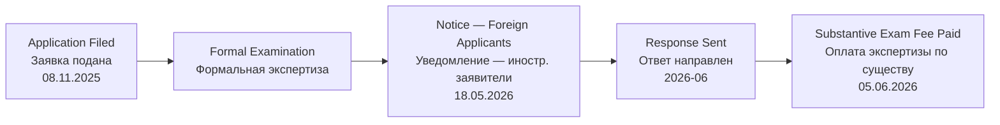

# NOTIFICATION — FOREIGN APPLICANTS / УВЕДОМЛЕНИЕ — ИНОСТРАННЫЕ ЗАЯВИТЕЛИ

**Kazpatent Official Document / Официальный Документ Казпатент**

**Formatted as Original A4 Document / Оформлено как Оригинальный Документ A4**

---

## DOCUMENT INFORMATION / ИНФОРМАЦИЯ О ДОКУМЕНТЕ

| Field / Поле | Value / Значение |
|-------------|-----------------|
| **Document Type / Тип Документа** | Notification (free form) — foreign applicants / Уведомление по заявке (свободная форма) — иностранные заявители |
| **Application Number / Номер Заявки** | KZ 2025/1097.1 |
| **Barcode / Штрихкод** | 3976583 |
| **Date / Дата** | 18 May 2026 / 18 мая 2026 |
| **Direction / Направление** | Incoming / Входящий |
| **From / От** | Kazpatent (NIIS, Ministry of Justice of RK) / Казпатент (НИИС, МЮ РК) |
| **To / Кому** | Banchenko Denis Yurievich / Банченко Денис Юрьевич |

> **Note / Примечание:** The PDF body itself contains no application number. Attribution to KZ 2025/1097.1 is derived from the NIIS portal registry entry for barcode 3976583, recorded 18.05.2026 at 17:13:40.

---

## EXAMINATION STATUS / СТАТУС ЭКСПЕРТИЗЫ

---

## ORIGINAL DOCUMENT CONTENT / СОДЕРЖИМОЕ ОРИГИНАЛЬНОГО ДОКУМЕНТА

---

### RUSSIAN ORIGINAL / РУССКИЙ ОРИГИНАЛ

**РЕСПУБЛИКАНСКОЕ ГОСУДАРСТВЕННОЕ ПРЕДПРИЯТИЕ НА ПРАВЕ ХОЗЯЙСТВЕННОГО ВЕДЕНИЯ**  
**«НАЦИОНАЛЬНЫЙ ИНСТИТУТ ИНТЕЛЛЕКТУАЛЬНОЙ СОБСТВЕННОСТИ»**  
**КОМИТЕТА ПО ПРАВАМ ИНТЕЛЛЕКТУАЛЬНОЙ СОБСТВЕННОСТИ**  
**МИНИСТЕРСТВА ЮСТИЦИИ РЕСПУБЛИКИ КАЗАХСТАН**

010000, г. Астана, район «Есиль», проспект Мангилик Ел, здание 57 А, н.п.8.  
Тел: (7172) 62 15 15  
https://qazpatent.kz , e-mail: qazpatent@qazpatent.kz

---

Банченко Денис Юрьевич  
ул. Комарова 37, 56, г. Байконур,  
Кызылординская область, 468320,  
denisbanchenko@asrp.tech

---

Настоящим сообщаем, что в представленном Заявлении о выдаче патента Республики Казахстан на изобретение кроме гражданина Республики Казахстан Банченко Дениса Юрьевича в качестве заявителя также указаны иностранные физические лица — ОВСЯННИКОВА ВАЛЕРИЯ АЛЕКСАНДРОВНА (Республика Молдова), КАПУСТИН МИХАЙЛО МИХАЙЛОВИЧ (Федеративная Республика Германия).

Согласно пункту 5 статьи 36 Патентного Закона Республики Казахстан от 16 июля 1999 года № 427-I (далее — Закон), физические лица, проживающие за пределами Республики Казахстан, или иностранные юридические лица осуществляют свои права заявителя, патентообладателя, а также права заинтересованного лица в уполномоченном органе и его организациях через патентных поверенных.

Пунктом 1 статьи 38 Закона установлено, что иностранные физические и юридические лица пользуются правами, предусмотренными Законом, наравне с физическими и юридическими лицами Республики Казахстан в силу международных договоров, участником которых является Республика Казахстан или на основе принципа взаимности.

В настоящее время отсутствуют двусторонние соглашения между Республикой Казахстан с Республикой Молдова и Федеративной Республикой Германия, предоставляющие национальным заявителям одного государства право на основе принципа взаимности вести дела непосредственно с патентным ведомством другого государства.

В этой связи, на основании пункта 5 статьи 36 Закона сообщаем о необходимости назначения представителя заявителя — патентного поверенного Республики Казахстан для реализации своих прав на получение патента на изобретение. Полномочия патентного поверенного удостоверяются доверенностью.

---

Подписано ЭЦП: Д. Алимжанова (Руководитель управления)

Исп.: К. Калабаева

---

### ENGLISH TRANSLATION / АНГЛИЙСКИЙ ПЕРЕВОД

**REPUBLICAN STATE ENTERPRISE ON THE RIGHT OF ECONOMIC MANAGEMENT**  
**"NATIONAL INSTITUTE OF INTELLECTUAL PROPERTY"**  
**OF THE COMMITTEE ON INTELLECTUAL PROPERTY RIGHTS**  
**OF THE MINISTRY OF JUSTICE OF THE REPUBLIC OF KAZAKHSTAN**

010000, Astana, "Yesil" district, Mangilik El Avenue, building 57A, p.o.8.  
Tel: (7172) 62 15 15  
https://qazpatent.kz , e-mail: qazpatent@qazpatent.kz

---

Banchenko Denis Yurievich  
37/56 Komarova St., Baikonur city,  
Kyzylorda region, 468320,  
denisbanchenko@asrp.tech

---

We hereby notify you that the Application for the grant of a patent of the Republic of Kazakhstan for an invention — in addition to Kazakhstani national Banchenko Denis Yurievich — also names the following foreign natural persons as applicants: OVSYANNIKOVA VALERIA ALEXANDROVNA (Republic of Moldova), KAPUSTIN MYKHAILO MYKHAILOVYCH (Federal Republic of Germany).

Pursuant to Article 36, paragraph 5 of the Patent Law of the Republic of Kazakhstan dated 16 July 1999 No. 427-I (hereinafter — the Law), natural persons residing outside the Republic of Kazakhstan, or foreign legal entities, shall exercise their rights as applicant, patent holder, and interested party before the authorized body and its organizations through patent attorneys.

Article 38, paragraph 1 of the Law establishes that foreign natural and legal persons shall enjoy the rights provided for by the Law on equal terms with natural and legal persons of the Republic of Kazakhstan by virtue of international treaties to which the Republic of Kazakhstan is a party, or on the basis of the principle of reciprocity.

At present, there are no bilateral agreements between the Republic of Kazakhstan and the Republic of Moldova, or between the Republic of Kazakhstan and the Federal Republic of Germany, that would grant nationals of one state the right, on the basis of reciprocity, to conduct proceedings directly with the patent office of the other state.

In view of the above, pursuant to Article 36, paragraph 5 of the Law, we notify you of the requirement to appoint a representative of the applicant — a patent attorney of the Republic of Kazakhstan — in order to exercise the rights to obtain a patent for the invention. The authority of the patent attorney shall be confirmed by a power of attorney.

---

Signed with EDS: D. Alimzhanova (Head of Division)

Prepared by: K. Kalabayeva

---

## LEGAL REFERENCES / ПРАВОВЫЕ ОСНОВАНИЯ

| Article / Статья | Substance / Содержание |
|-----------------|----------------------|
| **Art. 36(5) Patent Law No. 427-I / Ст. 36(5) Патентного Закона №427-I** | Foreign persons must act through Kazakhstani patent attorneys / Иностранные лица действуют через патентных поверенных РК |
| **Art. 38(1) Patent Law No. 427-I / Ст. 38(1) Патентного Закона №427-I** | Equal rights for foreigners via treaties or reciprocity / Равные права иностранцев через договоры или принцип взаимности |
| **No KZ–MD bilateral agreement / Нет соглашения КЗ–МД** | No reciprocity basis for direct filing from Moldova / Отсутствует основание для прямой подачи из Молдовы |
| **No KZ–DE bilateral agreement / Нет соглашения КЗ–ГЕ** | No reciprocity basis for direct filing from Germany / Отсутствует основание для прямой подачи из Германии |

---

## RELATED DOCUMENTS / СВЯЗАННЫЕ ДОКУМЕНТЫ

| # | Document / Документ | Date / Дата | Link / Ссылка |
|---|--------------------|-------------|---------------|
| 1 | Application / Заявка | 08.11.2025 | [PDF](../docs/applications/) |
| 2 | Formal Exam Query / Запрос ФЭ | 06.01.2026 | [EN/RU](./2026-01-06_FormalExamQuery_EN_RU.md) |
| 3 | Positive Formal Result / Положительный результат ФЭ | 18.03.2026 | [EN/RU](./2026-03-18_PositiveFormalResult_EN_RU.md) |
| 4 | Incoming Notice (this document) / Входящее уведомление (данный документ) | 18.05.2026 | [PDF](../correspondence/incoming/2026-05-18_Incoming_KZ2025-1097.1_ForeignApplicantNotice_Barcode3976583.pdf) |

---

**Document Translation Prepared By / Перевод Документа Подготовлен:** ASRP Translation System  
**Date / Дата:** 07 June 2026  
**Verification / Проверка:** Verified against original Kazpatent document (pdftotext -layout extraction)

---

*This is a bilingual (EN/RU) translation formatted as the original A4 document. For legal purposes, refer to the original Russian version.*
