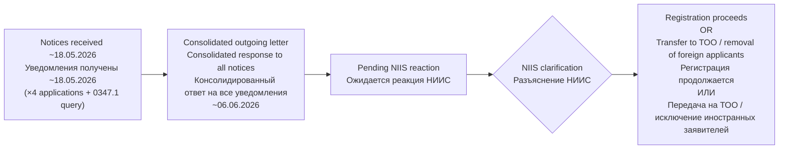

# OUTGOING APPLICANT LETTER: FOREIGN APPLICANT & PATENT ATTORNEY RESPONSE / ИСХОДЯЩЕЕ ПИСЬМО ЗАЯВИТЕЛЯ: ОТВЕТ НА УВЕДОМЛЕНИЯ ОБ ИНОСТРАННЫХ ЗАЯВИТЕЛЯХ И ПАТЕНТНОМ ПОВЕРЕННОМ

**Kazpatent Correspondence / Переписка с Казпатентом**

---

## DOCUMENT INFORMATION / ИНФОРМАЦИЯ О ДОКУМЕНТЕ

| Field / Поле | Value / Значение |
|---|---|
| **Document Type / Тип Документа** | Outgoing applicant letter / Исходящее письмо заявителя |
| **Applications / Номера Заявок** | See table below / См. таблицу ниже |
| **Date / Дата** | Undated original, sent approx. 06 June 2026 / Оригинал без даты, отправлено прибл. 06 июня 2026 |
| **Direction / Направление** | Outgoing / Исходящий |
| **From / От** | Banchenko Denis Yurievich / Банченко Денис Юрьевич |
| **To / Кому** | Head of Department D. Alimzhanov, NIIS (Kazpatent) / Руководителю управления Д. Алимжанову, НИИС (Казпатент) |

---

## APPLICATIONS COVERED / ОХВАТЫВАЕМЫЕ ЗАЯВКИ

| # | Application No. / Номер заявки | Covered / Включена |
|---|---|---|
| 1 | 2025/0592.1 | Yes / Да |
| 2 | 2025/0914.1 | Yes / Да |
| 3 | 2025/1095.1 | Yes / Да |
| 4 | 2025/1096.1 | Yes / Да |
| 5 | 2025/1097.1 | Yes / Да |
| 6 | 2026/0347.1 | Yes / Да |

> **Note / Примечание:** The letter also extends to any other applications for which analogous notices and queries regarding foreign applicant participation were issued / Письмо также распространяется на иные заявки, по которым были направлены аналогичные уведомления и запросы относительно участия иностранных заявителей.

---

## PROCEDURAL TIMELINE / ПРОЦЕССУАЛЬНАЯ ХРОНОЛОГИЯ

---

## ORIGINAL RUSSIAN TEXT / ОРИГИНАЛЬНЫЙ ТЕКСТ НА РУССКОМ ЯЗЫКЕ

---

В РЕСПУБЛИКАНСКОЕ ГОСУДАРСТВЕННОЕ ПРЕДПРИЯТИЕ
НА ПРАВЕ ХОЗЯЙСТВЕННОГО ВЕДЕНИЯ
«НАЦИОНАЛЬНЫЙ ИНСТИТУТ ИНТЕЛЛЕКТУАЛЬНОЙ СОБСТВЕННОСТИ»
КОМИТЕТА ПО ПРАВАМ ИНТЕЛЛЕКТУАЛЬНОЙ СОБСТВЕННОСТИ
МИНИСТЕРСТВА ЮСТИЦИИ РЕСПУБЛИКИ КАЗАХСТАН

Руководителю управления Д. Алимжанову

от Гражданина Республики Казахстан Банченко Дениса Юрьевича

по заявкам: № 2025/0592.1, 2025/0914.1, 2025/1096.1, 2025/1095.1, 2025/1097.1, 2026/0347.1, а также иным заявкам, по которым были направлены аналогичные уведомления и запросы относительно участия иностранных заявителей.

---

Уважаемые коллеги!

В ответ на полученные уведомления и запросы относительно необходимости назначения патентного поверенного Республики Казахстан в связи с участием в заявках иностранных физических лиц хотим пояснить следующие:

Считаем необходимым обратить внимание, что ссылка на иностранное гражданство заявителей в качестве основания для отказа в регистрации прав либо совершении иных действий, предусмотренных Патентным законом Республики Казахстан, не соответствует требованиям действующего законодательства Республики Казахстан.

Согласно статье 38 Патентного закона Республики Казахстан иностранные физические и юридические лица пользуются правами, предусмотренными данным Законом, наравне с физическими и юридическими лицами Республики Казахстан.

Указанная норма не содержит ограничений, связанных с невозможностью приобретения, регистрации, передачи либо осуществления патентных прав исключительно по причине иностранного гражданства заявителя.

Все лица, участвующие в поданных материалах, надлежащим образом идентифицированы, обладают присвоенными индивидуальными идентификационными номерами (ИИН), сведения о них содержатся в государственных информационных системах Республики Казахстан и позволяют однозначно установить личность каждого правообладателя и заявителя.

В связи с изложенным просим указать конкретную норму закона Республики Казахстан либо международного договора, участником которого является Республика Казахстан, прямо запрещающую регистрацию соответствующих прав в рассматриваемом случае. При отсутствии такой нормы просим осуществить регистрацию в установленном законом порядке.

---

Так же просим дать пояснение по следующим вопросам:

**1. Возможность замены заявителей на юридическое лицо**

В настоящее время заявитель Банченко Денис Юрьевич является руководителем ТОО «Перспективные Научно-Исследовательские Разработки» (БИН 240140033296).

Просим разъяснить:
- допускается ли передача прав заявителей по вышеуказанным заявкам в пользу ТОО «Перспективные Научно-Исследовательские Разработки»;
- возможно ли внесение соответствующих изменений посредством ходатайства;
- какие документы необходимо представить для такой замены;
- требуется ли согласие всех первоначальных заявителей;
- сохраняются ли при этом даты подачи заявок и приоритет.

**2. Статус иностранных заявителей**

Просим дополнительно разъяснить, подлежит ли применению требование о назначении патентного поверенного Республики Казахстан в случае, если иностранные заявители имеют индивидуальные идентификационные номера Республики Казахстан (ИИН), а также иные регистрационные данные, позволяющие осуществлять юридически значимые действия на территории Республики Казахстан. Просим сообщить, учитываются ли указанные обстоятельства при определении порядка ведения дел по заявке.

**3. Возможность изменения состава заявителей**

В случае если передача прав на заявки в пользу ТОО невозможна либо требует отдельной процедуры, просим разъяснить:
- возможно ли исключение иностранных заявителей из состава заявителей;
- какой порядок внесения таких изменений предусмотрен законодательством Республики Казахстан;
- какие документы необходимо представить;
- влияет ли такое изменение на дату приоритета и дальнейшее рассмотрение заявок.

Просим считать настоящее письмо официальным запросом о разъяснении порядка дальнейших действий по указанным заявкам.

С уважением,
Банченко Денис Юрьевич

---

## ENGLISH TRANSLATION / ПЕРЕВОД НА АНГЛИЙСКИЙ ЯЗЫК

---

TO THE REPUBLICAN STATE ENTERPRISE
ON THE RIGHT OF ECONOMIC MANAGEMENT
"NATIONAL INSTITUTE OF INTELLECTUAL PROPERTY"
OF THE COMMITTEE ON INTELLECTUAL PROPERTY RIGHTS
OF THE MINISTRY OF JUSTICE OF THE REPUBLIC OF KAZAKHSTAN

To the Head of Department D. Alimzhanov

From: Citizen of the Republic of Kazakhstan Banchenko Denis Yurievich

Re applications: No. 2025/0592.1, 2025/0914.1, 2025/1096.1, 2025/1095.1, 2025/1097.1, 2026/0347.1, as well as any other applications for which analogous notices and queries regarding participation of foreign applicants were issued.

---

Dear Colleagues,

In response to the notices and queries received regarding the requirement to appoint a patent attorney of the Republic of Kazakhstan in connection with the participation of foreign natural persons in the applications, we wish to clarify the following:

We consider it necessary to draw attention to the fact that invoking the foreign citizenship of applicants as a ground for refusing to register rights or to perform other actions provided for by the Patent Law of the Republic of Kazakhstan does not comply with the requirements of the current legislation of the Republic of Kazakhstan.

Pursuant to Article 38 of the Patent Law of the Republic of Kazakhstan, foreign natural and legal persons enjoy the rights provided for by this Law on equal terms with natural and legal persons of the Republic of Kazakhstan.

The said provision does not contain any restrictions relating to the impossibility of acquiring, registering, transferring, or exercising patent rights solely on the grounds of the applicant's foreign citizenship.

All persons participating in the submitted materials have been duly identified, have been assigned individual identification numbers (IIN), and their details are contained in the state information systems of the Republic of Kazakhstan, enabling unambiguous identification of each right holder and applicant.

In view of the foregoing, we request that you indicate the specific provision of the law of the Republic of Kazakhstan or an international treaty to which the Republic of Kazakhstan is a party that directly prohibits the registration of the relevant rights in the case under consideration. In the absence of such a provision, we request that registration be carried out in accordance with the procedure established by law.

---

We also request clarification on the following matters:

**1. Possibility of substituting applicants with a legal entity**

At present, applicant Banchenko Denis Yurievich is the director of LLP "Perspektivnye Nauchno-Issledovatelskie Razrabotki" [Promising Scientific Research and Development] (BIN 240140033296).

We request clarification on the following:
- whether the transfer of applicants' rights under the above-mentioned applications to LLP "Perspektivnye Nauchno-Issledovatelskie Razrabotki" is permissible;
- whether it is possible to make the corresponding amendments by means of a petition;
- what documents are required to be submitted for such substitution;
- whether the consent of all original applicants is required;
- whether the filing dates and priority of the applications are preserved upon such transfer.

**2. Status of foreign applicants**

We additionally request clarification as to whether the requirement to appoint a patent attorney of the Republic of Kazakhstan applies in the event that the foreign applicants hold individual identification numbers (IIN) of the Republic of Kazakhstan, as well as other registration data enabling them to perform legally significant actions on the territory of the Republic of Kazakhstan. We request information as to whether these circumstances are taken into account when determining the procedure for conducting proceedings on the application.

**3. Possibility of changing the composition of applicants**

In the event that the transfer of rights to the applications in favour of the LLP is not possible or requires a separate procedure, we request clarification on the following:
- whether it is possible to exclude foreign applicants from the composition of applicants;
- what procedure for making such amendments is provided for by the legislation of the Republic of Kazakhstan;
- what documents are required to be submitted;
- whether such amendment affects the priority date and the further examination of the applications.

We request that this letter be considered an official request for clarification of the procedure for further actions with respect to the applications indicated.

Respectfully,
Banchenko Denis Yurievich

---

## RELATED DOCUMENTS / СВЯЗАННЫЕ ДОКУМЕНТЫ

| # | Document / Документ | Date / Дата |
|---|---|---|
| 1 | Notices re foreign applicant / patent attorney requirement (×4 applications) / Уведомления о требовании патентного поверенного (×4 заявки) | ~18.05.2026 |
| 2 | Query re application 2026/0347.1 / Запрос по заявке 2026/0347.1 | ~18.05.2026 |
| 3 | This outgoing consolidated response / Настоящий исходящий консолидированный ответ | ~06.06.2026 |

---

**Document Translation Prepared By / Перевод Документа Подготовлен:** ASRP Translation System
**Date / Дата:** 07 June 2026
**Verification / Проверка:** Verified against original PDF (pdftotext extraction)

---

*This is a bilingual (EN/RU) translation of the original outgoing letter. The Russian text above is transcribed verbatim from the PDF original. For legal purposes, refer to the original PDF document.*
